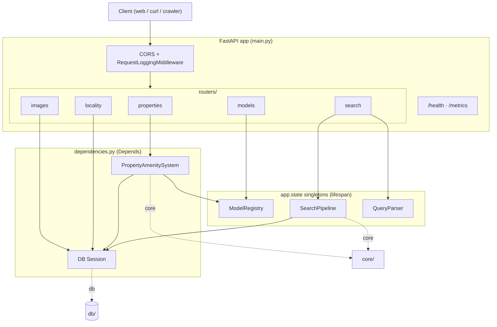
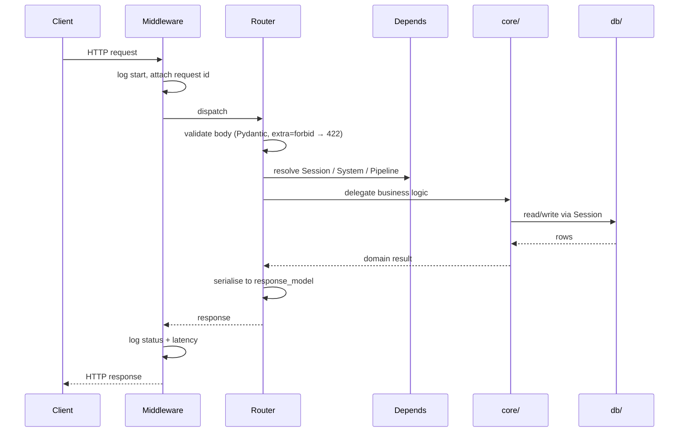

# API Layer (FastAPI)

The `api/` package is the HTTP boundary. It owns routing, request/response
schemas, middleware, and dependency wiring — and nothing else. All business
logic lives in [`core/`](../core/README.md); all persistence lives in
[`db/`](../db/README.md). Routers stay thin: parse → delegate → serialise.

## Modules

| File | Responsibility |
|------|----------------|
| `main.py` | App factory + lifespan. On startup builds `ModelRegistry`, `SearchPipeline`, `QueryParser`, DB tables; attaches Prometheus instrumentation; stores singletons on `app.state`. Mounts routers, CORS, request-logging middleware. Serves `/health` and `/metrics`. |
| `routers/properties.py` | Property CRUD, per-image detection, describe, listing search. |
| `routers/images.py` | Serve stored image bytes; PATCH image metadata (`alt_text`, `caption`, `is_primary`, `display_order`). |
| `routers/search.py` | Hybrid NL search endpoint → delegates to `SearchPipeline`. |
| `routers/locality.py` | Locality preview + persist, blocking and SSE-streamed. |
| `routers/models.py` | List available VLMs from the registry. |
| `schemas.py` | Pydantic request/response models. `extra="forbid"` + `model_dump(exclude_unset=True)` on PATCH so "omit" ≠ "clear". Mirrored by `web/lib/schemas.ts`. |
| `middleware.py` | `RequestLoggingMiddleware` — structured per-request logs. |
| `dependencies.py` | `Depends()` providers: DB session, system, pipeline, registry. |
| `logging_config.py` | Compatibility shim over `core.logging_config`. |

## Component wiring

## Request lifecycle

## Endpoints

| Method | Path | Router | Delegates to |
|--------|------|--------|--------------|
| `POST` | `/api/v1/properties/` | properties | `create_property_shell` |
| `PATCH` | `/api/v1/properties/{id}` | properties | `AmenityDataManager.update_property` |
| `POST` | `/api/v1/properties/{id}/images` | properties | `process_one_image` |
| `POST` | `/api/v1/properties/{id}/describe` | properties | `generate_description_from_amenities` |
| `GET` | `/api/v1/properties/` · `/{id}` · `/by-slug/{slug}` · `/search` | properties | `AmenityDataManager` reads |
| `DELETE` | `/api/v1/properties/{id}` | properties | `AmenityDataManager.delete_property` |
| `POST` | `/api/v1/search` | search | `SearchPipeline.search` |
| `POST` | `/api/v1/locality` · `/properties/{id}/locality` (+ `/stream`) | locality | `LocalityAgent` |
| `GET` | `/api/v1/images/{id}` · `PATCH` | images | file serve · `update_image` |
| `GET` | `/api/v1/models/` | models | `ModelRegistry.available_models` |
| `GET` | `/health` · `/metrics` | main | DB ping · Prometheus |

### Contract invariants

- Both PATCH endpoints use `model_dump(exclude_unset=True)`: omit a key to leave
  it untouched, send `null` to clear it.
- `extra="forbid"` returns HTTP 422 on unknown keys — this is what blocks
  attempts to mutate the immutable `slug`.
- Locality streaming endpoints emit Server-Sent Events (one frame per category,
  then a final result frame); upstream OSM failures become a clean SSE `error`
  frame with CORS headers, never a masked 500.
