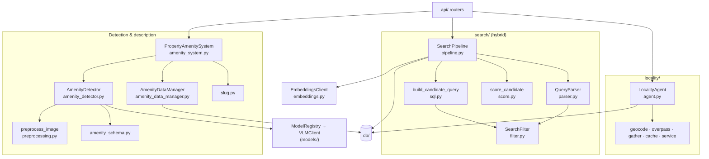
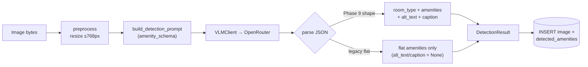
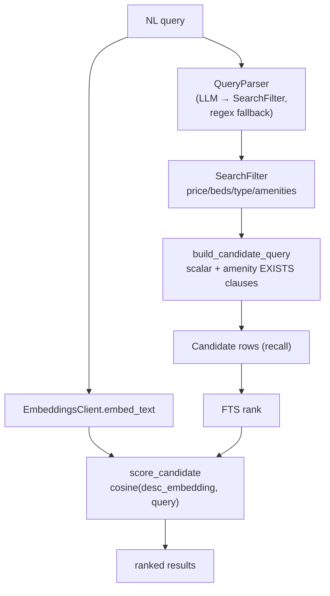
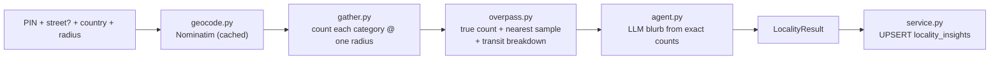

# Core Logic

`core/` holds every non-HTTP, non-persistence decision: image preprocessing,
VLM detection, description generation, CRUD orchestration, hybrid search, and
locality enrichment. It is imported by [`api/`](../api/README.md) and writes
through [`db/`](../db/README.md). It never imports FastAPI.

## Modules

| File / package | Responsibility |
|----------------|----------------|
| `amenity_system.py` | `PropertyAmenitySystem` — top-level orchestrator. Wires detector + data manager + registry. Owns `create_property_shell`, `process_one_image`, `generate_description_from_amenities`. |
| `amenity_detector.py` | `AmenityDetector` — builds prompts, calls the VLM, parses the Phase 9 JSON (room_type, per-amenity present/confidence, alt_text, caption) with legacy-flat fallback; returns `DetectionResult`. |
| `amenity_data_manager.py` | `AmenityDataManager` — all SQLAlchemy reads/writes for properties, images, amenities. Enforces the single-hero-image invariant. |
| `preprocessing.py` | `preprocess_image` — resize longest edge to ≤768px before inference. |
| `amenity_schema.py` | Canonical amenity catalogue fed into the detection prompt. |
| `slug.py` | `make_slug(name, id)` — immutable, URL-safe public slug. |
| `embeddings.py` | `EmbeddingsClient` — OpenAI-compatible embedding calls for search indexing/query. |
| `search/` | Hybrid NL search pipeline (see below). |
| `locality/` | Neighbourhood enrichment — has its own [README](locality/README.md). |
| `logging_config.py` | `setup_logging()` — shared structured logging for api + web. |

## Subsystem map

## Detection pipeline

`DetectionResult` carries `amenities_by_room`, `flat_amenities`,
`flat_confidences`, `alt_text`, and `room_caption`. `alt_text`/`caption` are
trimmed to 500 chars at a word boundary so the columns never overflow.

## Hybrid search pipeline

Two-stage: cheap FTS/SQL recall, then embedding rerank.

`reindex_property` / `build_index_text` keep `description_embedding` and the FTS
document fresh after writes. On SQLite (tests) the vector path degrades
gracefully; pgvector is used in Postgres.

## Locality enrichment

Deterministic single-radius POI counts from OSM, plus an LLM blurb written from
the exact numbers. Full internals — module table, data flow, transit
classification, caching, and $0/compliance design — live in
[`core/locality/README.md`](locality/README.md).

