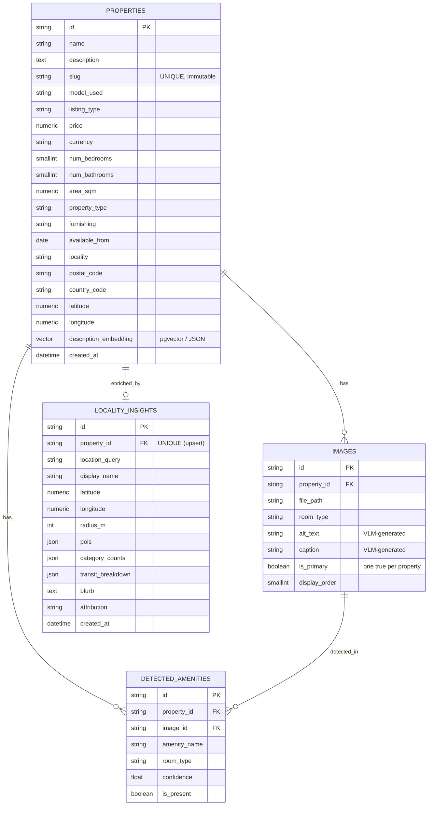
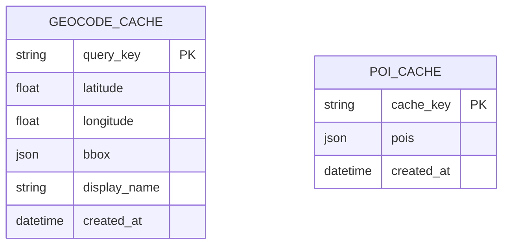
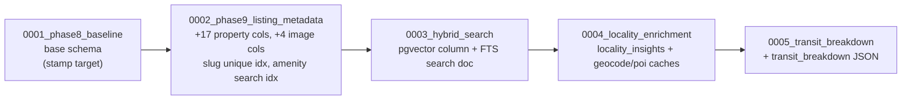

# Database Layer

`db/` owns the persistence contract: SQLAlchemy 2.0 ORM models, the session
factory, a portable vector column type, and the Alembic migration chain. It is
consumed by [`core/`](../core/README.md) (which does the actual reads/writes)
and never imports FastAPI.

## Modules

| File | Responsibility |
|------|----------------|
| `models.py` | ORM tables: `Property`, `PropertyImage`, `DetectedAmenity`, `LocalityInsight`, `GeocodeCache`, `PoiCache`. Uses `Mapped[]` + `mapped_column` for full type-checker support. |
| `session.py` | Engine, `SessionLocal`, `get_db()` dependency, `create_tables()`, `check_db_connection()`. |
| `types.py` | `Embedding` `TypeDecorator` — `pgvector` `Vector` on PostgreSQL, JSON list on SQLite (so tests run without Postgres). |
| `migrations/` | Alembic env + versioned revisions (schema is owned by Alembic, not `create_all`). |

### Portability note

UUIDs are stored as `String(36)` and embeddings degrade to JSON on SQLite. This
lets the unit/integration suites run on in-memory SQLite while production uses
PostgreSQL 16 + `pgvector`.

## Entity relationships



Two standalone cache tables back the locality package (no FK to properties —
they cache OSM data across all requests):



## Key invariants

- **Slug** — one per property, immutable, derived from `make_slug(name, id)` at
  shell creation. Public listing URLs stay stable; PATCH cannot change it.
- **Hero image** — exactly one `images.is_primary = True` per property, enforced
  in `AmenityDataManager.update_image` (siblings flipped false in the same flush).
- **Locality upsert** — unique `property_id` on `locality_insights` means
  re-running enrichment updates the single row instead of duplicating.

## Migration chain



| Revision | Purpose |
|----------|---------|
| `0001_phase8_baseline` | Schema as of Phase 8. `alembic stamp` target for databases originally built via `create_all`. |
| `0002_phase9_listing_metadata` | Listing metadata columns + image display columns; unique `slug` index; partial index for amenity search. All new property columns nullable; image defaults backfill on `ALTER`. |
| `0003_hybrid_search` | `description_embedding` (pgvector) + Postgres FTS search document for hybrid recall. |
| `0004_locality_enrichment` | `locality_insights`, `geocode_cache`, `poi_cache` tables. |
| `0005_transit_breakdown` | Adds `transit_breakdown` JSON to `locality_insights`. |

### Applying

```bash
# Fresh database
docker compose exec api alembic upgrade head

# Pre-Alembic database (schema already created via create_all)
docker compose exec api alembic stamp 0001_phase8_baseline
docker compose exec api alembic upgrade head

# Roll back one revision
docker compose exec api alembic downgrade -1
```

Inside the API container call `alembic` directly (`uv` only exists in the
builder image); use `uv run alembic …` on the host.
